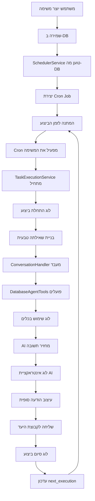

# 🏗️ ארכיטקטורת מערכת התזמון החדשה - Database-Driven

## סקירה כללית

מעבר מיוזמת קבצי טקסט למערכת מבוססת מסד נתונים לניהול משימות מתוזמנות דרך דשבורד וב.

## 📊 ארכיטקטורה קיימת (v4.3)

```
┌─────────────────┐    ┌──────────────────┐    ┌─────────────────┐
│   Text Files    │◄───┤  SchedulerService │───►│   Cron Jobs     │
│   schedules/    │    │   + FileWatcher   │    │   node-cron     │
└─────────────────┘    └──────────────────┘    └─────────────────┘
                                │
                                ▼
                       ┌──────────────────┐
                       │ ConversationHandler │
                       │   + AI Agent      │
                       └──────────────────┘
                                │
                                ▼
                       ┌──────────────────┐
                       │ DatabaseAgentTools │
                       │   5 Smart Tools   │
                       └──────────────────┘
```

## 🚀 ארכיטקטורה חדשה (v5.0)

```
┌─────────────────┐    ┌──────────────────┐    ┌─────────────────┐
│  Web Dashboard  │───►│    Web API       │───►│   SQLite DB     │
│  Task Manager   │    │  /api/tasks/*    │    │scheduled_tasks  │
└─────────────────┘    └──────────────────┘    └─────────────────┘
                                                        │
                                                        ▼
┌─────────────────┐    ┌──────────────────┐    ┌─────────────────┐
│   Cron Jobs     │◄───┤  SchedulerService │◄───┤   Task Loader   │
│   node-cron     │    │   DB-Driven      │    │   From DB       │
└─────────────────┘    └──────────────────┘    └─────────────────┘
        │                       │
        ▼                       ▼
┌─────────────────┐    ┌──────────────────┐
│ Task Execution  │    │   Execution      │
│   + Logging     │    │     Logger       │
└─────────────────┘    └──────────────────┘
        │                       │
        ▼                       ▼
┌─────────────────┐    ┌──────────────────┐
│ConversationHandler│    │task_execution_logs│
│   + AI Agent    │    │      Table       │
└─────────────────┘    └──────────────────┘
        │
        ▼
┌─────────────────┐
│DatabaseAgentTools│
│   5 Smart Tools │
└─────────────────┘
```

## 🔧 רכיבי המערכת

### 1. **Frontend Layer - Web Dashboard**

**TasksComponent.js** (מורחב)
- יוצר/עורך/מוחק משימות
- תצוגת סטטוס real-time
- הצגת לוגי ביצוע
- ממשק ידידותי למשתמש

**API Endpoints חדשים:**
```javascript
POST   /api/tasks              // יצירת משימה
GET    /api/tasks              // רשימת משימות  
PUT    /api/tasks/:id          // עדכון משימה
DELETE /api/tasks/:id          // מחיקת משימה
GET    /api/tasks/:id/logs     // לוגי ביצוע
POST   /api/tasks/:id/execute  // ביצוע מיידי
```

### 2. **Backend Layer - Database & Logic**

**DatabaseManager.js** (מורחב)
```javascript
// טבלאות חדשות
- scheduled_tasks      // משימות מתוזמנות
- task_execution_logs  // לוגי ביצוע
- task_targets        // קבוצות יעד (normalized)

// שיטות חדשות
- createScheduledTask()
- updateScheduledTask()
- getScheduledTasks()
- deleteScheduledTask()
- logTaskExecution()
- getTaskLogs()
```

**SchedulerService.js** (שונה)
```javascript
// הסרת קריאת קבצים
- loadSchedulesFromFiles() ❌
- setupFileWatching() ❌

// הוספת קריאת DB
+ loadSchedulesFromDatabase() ✅
+ syncCronJobsWithDatabase() ✅
+ executeTaskWithLogging() ✅
```

### 3. **Execution Layer - AI Agent Integration**

**TaskExecutionService.js** (חדש)
```javascript
class TaskExecutionService {
  async executeScheduledTask(taskId) {
    // 1. טעינת משימה מDB
    // 2. בניית query טבעי
    // 3. קריאה ל-ConversationHandler
    // 4. לוגינג מפורט
    // 5. שליחת תוצאות
  }
}
```

**ExecutionLogger.js** (חדש)
```javascript
class ExecutionLogger {
  async logTaskStart(taskId, context)
  async logToolUsage(taskId, toolName, params, result)  
  async logAIInteraction(taskId, query, response)
  async logTaskEnd(taskId, success, output)
  async getTaskExecutionHistory(taskId)
}
```

## 📊 מודל נתונים

### Core Tables

```sql
-- טבלת המשימות המתוזמנות
CREATE TABLE scheduled_tasks (
  id INTEGER PRIMARY KEY AUTOINCREMENT,
  name TEXT NOT NULL,
  description TEXT,
  action_type TEXT NOT NULL, -- 'daily_summary', 'weekly_summary', 'custom_query', 'send_message'
  target_groups TEXT NOT NULL, -- JSON array של שמות קבוצות
  cron_expression TEXT NOT NULL,
  custom_query TEXT, -- שאלה מותאמת אישית (אם action_type = 'custom_query')
  send_to_group TEXT NOT NULL,
  active BOOLEAN DEFAULT 1,
  created_at DATETIME DEFAULT CURRENT_TIMESTAMP,
  updated_at DATETIME DEFAULT CURRENT_TIMESTAMP,
  created_by TEXT, -- user identifier
  last_execution DATETIME,
  next_execution DATETIME
);

-- לוגי ביצוע המשימות
CREATE TABLE task_execution_logs (
  id INTEGER PRIMARY KEY AUTOINCREMENT,
  task_id INTEGER NOT NULL REFERENCES scheduled_tasks(id),
  execution_time DATETIME DEFAULT CURRENT_TIMESTAMP,
  
  -- AI Interaction Details
  ai_query TEXT NOT NULL, -- השאלה שנשלחה ל-AI
  ai_response TEXT, -- התשובה מ-AI
  ai_model TEXT, -- מודל שהשתמש (Claude 3.5 Sonnet)
  ai_tokens_used INTEGER, -- מספר טוקנים
  ai_processing_time INTEGER, -- זמן עיבוד במילישניות
  
  -- Tool Usage Tracking  
  tools_used TEXT, -- JSON array של כלים ששימשו
  tools_data TEXT, -- JSON של הנתונים שהתקבלו מכל כלי
  database_queries INTEGER DEFAULT 0, -- מספר שאילתות DB
  database_results INTEGER DEFAULT 0, -- מספר תוצאות
  
  -- Execution Results
  success BOOLEAN NOT NULL,
  error_message TEXT,
  output_message TEXT, -- ההודעה הסופית שנשלחה
  output_sent_to TEXT, -- לאיזה קבוצה נשלח
  
  -- Performance Metrics
  total_execution_time INTEGER, -- זמן ביצוע כולל
  memory_usage INTEGER, -- שימוש בזיכרון
  
  -- Metadata
  execution_context TEXT -- JSON של הקשר נוסף
);

-- אינדקסים לביצועים
CREATE INDEX idx_scheduled_tasks_active ON scheduled_tasks(active, next_execution);
CREATE INDEX idx_task_execution_logs_task_time ON task_execution_logs(task_id, execution_time);
CREATE INDEX idx_task_execution_logs_success ON task_execution_logs(success, execution_time);
```

## 🔄 מעגל החיים של משימה



## 🧩 אינטגרציה עם המערכת הקיימת

### מה נשאר זהה:
- ✅ ConversationHandler - אותה לוגיקה AI
- ✅ DatabaseAgentTools - אותם 5 כלים
- ✅ DatabaseManager - רק הוספת טבלאות
- ✅ WebServer - רק הוספת endpoints
- ✅ node-cron - אותה מערכת תזמון

### מה משתנה:
- 🔄 SchedulerService - מקור נתונים מDB
- 🔄 TasksComponent - ממשק מורחב
- ➕ TaskExecutionService - שירות ביצוע חדש
- ➕ ExecutionLogger - מערכת לוגים מפורטת

### מה מוסר:
- ❌ קבצי טקסט בתיקיית schedules/
- ❌ FileWatcher / chokidar
- ❌ ScheduleParser - פרסור קבצים

## 🚧 שלבי המעבר

### שלב 1: הכנה
- יצירת טבלאות DB חדשות
- מיגרציית נתונים מקבצי טקסט קיימים
- בדיקות יחידה לרכיבים חדשים

### שלב 2: פיתוח
- TaskExecutionService + ExecutionLogger
- שינוי SchedulerService לקרוא מDB
- הוספת API endpoints חדשים

### שלב 3: אינטגרציה
- עדכון Frontend לממשק החדש
- בדיקות אינטגרציה מלאות
- בדיקות ביצועים

### שלב 4: פריסה
- העלאה לסביבת ייצור
- ניטור וחזרה במידת הצורך
- תיעוד משתמש

## 📈 יתרונות הארכיטקטורה החדשה

### ביצועים:
- **מהירות**: שאילתות DB מהירות יותר מקריאת קבצים
- **זיכרון**: פחות שימוש בזיכרון (לא טעינת קבצים)
- **רשת**: פחות I/O operations

### יציבות:
- **אמינות**: DB יציב יותר מקבצי טקסט
- **שחזור**: DB backup וrestore מובנים
- **עקביות**: ACID compliance

### תחזוקה:
- **ניטור**: לוגים מפורטים ונגישים
- **דיבוג**: ראיית כל שלבי הביצוע
- **אנליטיקה**: סטטיסטיקות שימוש

### תכונות:
- **גמישות**: תמיכה בשאילתות מותאמות אישית
- **סקלביליות**: תמיכה במאות משימות
- **ממשק**: דשבורד אינטראקטיבי ונוח

## 🔒 אבטחה ושיקולים

### אבטחת נתונים:
- **הצפנה**: הצפנת רגישים בDB
- **הרשאות**: בקרת גישה למשימות
- **ביקורת**: לוג כל פעולת משתמש

### מגבלות ובקרה:
- **Rate Limiting**: הגבלת יצירת משימות
- **Resource Limits**: בקרת שימוש במשאבים  
- **Timeout Control**: מגבלות זמן ביצוע

### התאוששות:
- **Error Recovery**: חזרה אוטומטית על כשל
- **Data Integrity**: בדיקת תקינות נתונים
- **Backup Strategy**: גיבוי אוטומטי יומי

---

**גרסה:** v5.0-architecture  
**תאריך עדכון אחרון:** ספטמבר 2025  
**מחבר:** ניצן + Claude Code