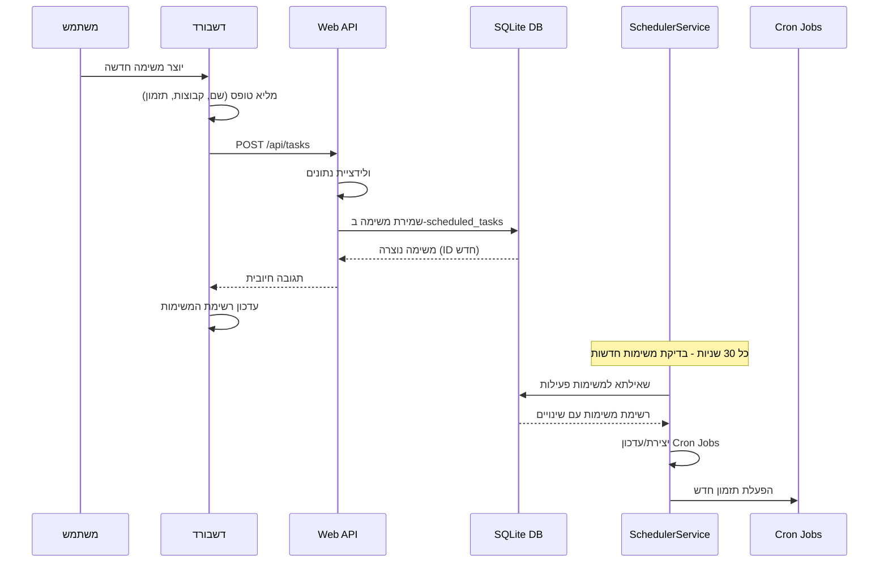
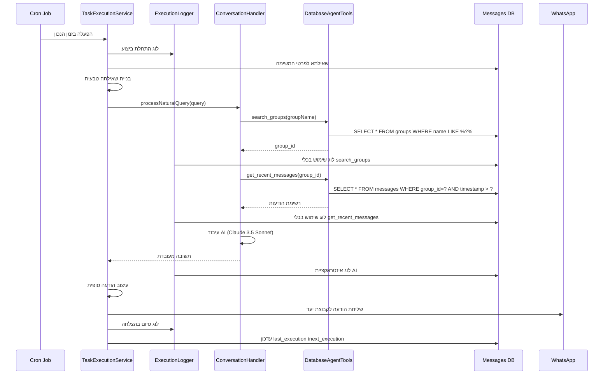
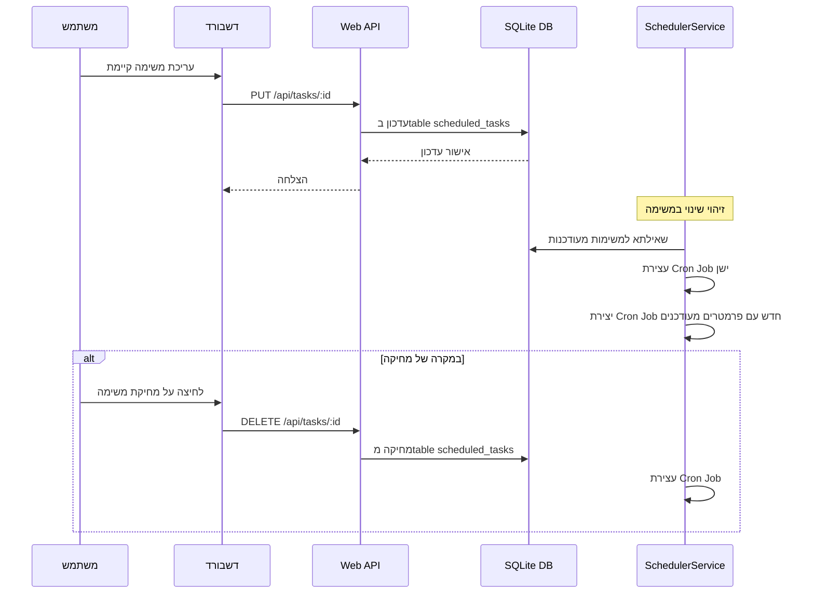

# 🔄 זרימת עבודה חדשה ודרישות מערכת

## 📋 סקירה כללית

מעבר ממערכת מבוססת קבצי טקסט למערכת DB-driven עם ממשק דשבורד מתקדם לניהול משימות מתוזמנות.

## 🌊 זרימת העבודה הראשית

### 1. **יצירת משימה חדשה**



### 2. **ביצוע משימה מתוזמנת**



### 3. **עדכון ומחיקת משימות**



## 📊 מפרט טבלאות מפורט

### טבלת `scheduled_tasks`

```sql
CREATE TABLE scheduled_tasks (
  -- מזהי ראשי ומטאדטה
  id INTEGER PRIMARY KEY AUTOINCREMENT,
  name TEXT NOT NULL UNIQUE, -- שם המשימה (ייחודי)
  description TEXT, -- תיאור אופציונלי
  
  -- סוג המשימה ותכנים
  action_type TEXT NOT NULL CHECK (action_type IN (
    'daily_summary',    -- סיכום יומי סטנדרטי
    'weekly_summary',   -- סיכום שבועי סטנדרטי  
    'today_summary',    -- סיכום של היום הנוכחי
    'custom_query',     -- שאלה מותאמת אישית
    'send_message',     -- שליחת הודעה קבועה
    'group_analytics'   -- אנליטיקה על הקבוצה
  )),
  
  -- קבוצות יעד
  target_groups TEXT NOT NULL, -- JSON array: ["קבוצה 1", "קבוצה 2"]
  target_group_ids TEXT, -- JSON array של IDs (cache)
  
  -- תזמון
  cron_expression TEXT NOT NULL, -- ביטוי CRON תקין
  timezone TEXT DEFAULT 'Asia/Jerusalem',
  
  -- תוכן המשימה
  custom_query TEXT, -- שאילתה מותאמת (אם action_type = 'custom_query')
  message_template TEXT, -- תבנית הודעה (אם action_type = 'send_message')
  
  -- יעד שליחה
  send_to_group TEXT NOT NULL, -- שם הקבוצה לשליחה
  send_to_group_id TEXT, -- ID של הקבוצה (cache)
  
  -- מצב וסטטוס
  active BOOLEAN DEFAULT 1,
  priority INTEGER DEFAULT 5, -- עדיפות (1-10)
  max_retries INTEGER DEFAULT 3, -- מספר ניסיונות בכישלון
  timeout_seconds INTEGER DEFAULT 300, -- timeout לביצוע
  
  -- זמנים
  created_at DATETIME DEFAULT CURRENT_TIMESTAMP,
  updated_at DATETIME DEFAULT CURRENT_TIMESTAMP,
  last_execution DATETIME, -- ביצוע אחרון בפועל
  next_execution DATETIME, -- ביצוע הבא המתוכנן
  
  -- יוצר ומשתמש
  created_by TEXT, -- מזהה המשתמש שיצר
  
  -- הגדרות מתקדמות
  execution_settings TEXT, -- JSON של הגדרות נוספות
  notification_settings TEXT -- JSON של הגדרות התראות
);

-- אינדקסים לביצועים
CREATE INDEX idx_scheduled_tasks_active_next ON scheduled_tasks(active, next_execution);
CREATE INDEX idx_scheduled_tasks_action_type ON scheduled_tasks(action_type, active);
CREATE INDEX idx_scheduled_tasks_created_by ON scheduled_tasks(created_by);
CREATE UNIQUE INDEX idx_scheduled_tasks_name ON scheduled_tasks(name);
```

### טבלת `task_execution_logs`

```sql
CREATE TABLE task_execution_logs (
  -- מזהה ראשי וקישור למשימה
  id INTEGER PRIMARY KEY AUTOINCREMENT,
  task_id INTEGER NOT NULL REFERENCES scheduled_tasks(id) ON DELETE CASCADE,
  execution_attempt INTEGER DEFAULT 1, -- ניסיון מספר (עבור retries)
  
  -- זמני ביצוע
  execution_start DATETIME DEFAULT CURRENT_TIMESTAMP,
  execution_end DATETIME,
  total_execution_time INTEGER, -- במילישניות
  
  -- אינטראקציה עם AI
  ai_query TEXT NOT NULL, -- השאילתה שנשלחה לAI
  ai_query_type TEXT, -- סוג השאילתה
  ai_response TEXT, -- התשובה המלאה מהAI
  ai_response_length INTEGER, -- אורך התשובה
  ai_model TEXT DEFAULT 'claude-3.5-sonnet', -- מודל שהשתמש
  ai_tokens_used INTEGER, -- מספר טוקנים
  ai_processing_time INTEGER, -- זמן עיבוד AI במילישניות
  ai_cost_estimate REAL, -- אומדן עלות (USD)
  
  -- כלים ששימשו
  tools_used TEXT, -- JSON array: ["search_groups", "get_recent_messages"]
  tools_data TEXT, -- JSON של נתונים מכל כלי
  tools_execution_time INTEGER, -- זמן ביצוע כל הכלים
  
  -- פעילות מסד נתונים
  database_queries INTEGER DEFAULT 0, -- מספר שאילתות
  database_results_count INTEGER DEFAULT 0, -- מספר תוצאות
  database_processing_time INTEGER, -- זמן עיבוד DB
  
  -- תוצאות ביצוע
  success BOOLEAN NOT NULL,
  error_message TEXT, -- הודעת שגיאה במקרה של כישלון
  error_type TEXT, -- סוג השגיאה
  retry_reason TEXT, -- סיבה לניסיון חוזר
  
  -- פלט ושליחה
  output_message TEXT, -- ההודעה הסופית שנשלחה
  output_message_length INTEGER,
  output_sent_to TEXT, -- לאיזה קבוצה נשלח
  output_delivery_status TEXT, -- סטטוס המשלוח
  
  -- מדדי ביצועים
  memory_usage_mb INTEGER, -- שימוש בזיכרון במהלך הביצוע
  cpu_usage_percent REAL, -- שימוש במעבד
  
  -- הקשר וסביבה
  execution_context TEXT, -- JSON של מידע נוסף
  system_load REAL, -- עומס המערכת בזמן הביצוע
  concurrent_tasks INTEGER DEFAULT 0, -- מספר משימות במקביל
  
  -- מטאדטה
  created_at DATETIME DEFAULT CURRENT_TIMESTAMP
);

-- אינדקסים לביצועים
CREATE INDEX idx_execution_logs_task_time ON task_execution_logs(task_id, execution_start);
CREATE INDEX idx_execution_logs_success_time ON task_execution_logs(success, execution_start);
CREATE INDEX idx_execution_logs_error_type ON task_execution_logs(error_type) WHERE error_type IS NOT NULL;
CREATE INDEX idx_execution_logs_ai_model ON task_execution_logs(ai_model, execution_start);
```

### טבלת `task_targets` (Normalized)

```sql
CREATE TABLE task_targets (
  id INTEGER PRIMARY KEY AUTOINCREMENT,
  task_id INTEGER NOT NULL REFERENCES scheduled_tasks(id) ON DELETE CASCADE,
  target_type TEXT NOT NULL CHECK (target_type IN ('group', 'user', 'channel')),
  target_name TEXT NOT NULL, -- שם הקבוצה/משתמש
  target_id TEXT, -- WhatsApp ID (אם ידוע)
  target_priority INTEGER DEFAULT 1, -- עדיפות בין יעדים
  active BOOLEAN DEFAULT 1,
  created_at DATETIME DEFAULT CURRENT_TIMESTAMP
);

CREATE INDEX idx_task_targets_task_id ON task_targets(task_id);
CREATE INDEX idx_task_targets_type ON task_targets(target_type, active);
```

## 📝 דרישות פונקציונליות מפורטות

### 1. **ניהול משימות**

**יצירת משימה:**
- ✅ שם משימה (חובה, ייחודי)
- ✅ בחירת סוג פעולה מרשימה מוגדרת
- ✅ בחירת קבוצות יעד (רב-בחירה עם autocomplete)
- ✅ הגדרת תזמון (ממשק ידידותי + CRON מתקדם)
- ✅ שאלה מותאמת אישית (למשימות custom_query)
- ✅ קבוצת יעד לשליחה
- ✅ הגדרות מתקדמות (עדיפות, timeout, retries)

**עריכת משימה:**
- ✅ עדכון כל שדות המשימה
- ✅ השהיה/הפעלה זמנית
- ✅ שכפול משימה קיימת
- ✅ תצוגה מקדימה של הוצאה (preview)

**מחיקת משימה:**
- ✅ מחיקה רכה (הפיכה ללא פעילה)
- ✅ מחיקה קשה (הסרה מהמערכת + לוגים)
- ✅ אישור משתמש לפני מחיקה

### 2. **ממשק משתמש (Dashboard)**

**תצוגת רשימת המשימות:**
```
┌─ שם המשימה ────────────────────────────────────┐
│ 📊 סיכום יומי - קבוצות AI                      │
├─────────────────────────────────────────────────┤
│ 🎯 קבוצות יעד:                                │
│    • AI-ACADEMY BY GUY AGA                    │
│    • קורס דיגיטלי | שימוש פרקטי בכלי AI        │
├─────────────────────────────────────────────────┤
│ ⏰ תזמון: יומי ב-16:00 (0 16 * * *)             │
│ 📤 שליחה לקבוצת: ניצן                          │
│ 🟢 פעיל | 🔄 ביצוע אחרון: 06/09 16:00         │
├─────────────────────────────────────────────────┤
│ [השהה] [ערוך] [בצע עכשיו] [לוגים] [מחק]        │
└─────────────────────────────────────────────────┘
```

**פילטרים וחיפוש:**
- 🔍 חיפוש לפי שם משימה
- 📂 פילטר לפי סוג פעולה
- ✅ הצגת משימות פעילות בלבד
- 📅 סינון לפי זמן ביצוע הבא
- 👤 סינון לפי יוצר המשימה

**סטטיסטיקות:**
- 📊 מספר משימות כולל/פעילות
- ⚡ ביצועים אחרונים
- 📈 גרף ביצועים לאורך זמן
- 🚨 התראות על כישלונות

### 3. **מערכת הביצוע**

**זרימת ביצוע משימה:**
1. **הכנה**: טעינת פרטי המשימה מDB
2. **ולידציה**: בדיקת תקינות קבוצות יעד
3. **בניית שאילתה**: יצירת שאילתה טבעית לAI
4. **ביצוע AI**: שליחה לConversationHandler
5. **עיבוד כלים**: שימוש בDatabaseAgentTools
6. **עיצוב תגובה**: הכנת הודעה סופית
7. **שליחה**: משלוח לקבוצת היעד
8. **לוגינג**: שמירת כל הפעולות

**טיפול בשגיאות:**
- 🔄 ניסיונות חוזרים אוטומטיים
- 📧 התראות למנהלים על כישלונות
- 📝 לוגים מפורטים לדיבוג
- ⏰ Timeout למניעת "קיפאון"

### 4. **מערכת הלוגים**

**סוגי לוגים:**
- 📋 **Task Logs**: התחלה, סיום, שגיאות
- 🤖 **AI Interaction**: שאילתות ותשובות
- 🛠️ **Tool Usage**: איזה כלים השתמשו ומה החזירו
- 📊 **Performance**: זמני ביצוע, זיכרון, עומס
- 📤 **Delivery**: סטטוס שליחת ההודעות

**ממשק לוגים:**
```
📋 משימה: סיכום יומי - קבוצות AI
🕐 ביצוע: 06/09/2025 16:00:15
⏱️ משך: 4.2 שניות
✅ סטטוס: הצליח

🤖 AI Query: "תסכם לי מה היה היום בקבוצת AI-ACADEMY BY GUY AGA"
🔧 כלים בשימוש:
  • search_groups("AI-ACADEMY BY GUY AGA") → מצא ID: abc123
  • get_recent_messages(abc123, today) → 47 הודעות
  • 
🧠 AI Response: 267 מילים, 1,234 תווים
📤 נשלח לקבוצת: ניצן (✅ התקבל)

📊 ביצועים:
  • זיכרון: 45MB
  • שאילתות DB: 3
  • זמן AI: 2.8s
  • זמן DB: 0.3s
```

## ⚙️ דרישות טכניות

### ביצועים:
- **זמן תגובה**: מתחת ל-5 שניות לביצוע משימה
- **טעינת דשבורד**: מתחת ל-2 שניות
- **זיכרון**: מתחת ל-100MB לכל משימה פעילה
- **מקבילות**: תמיכה ב-10 משימות במקביל

### זמינות:
- **Uptime**: 99.9% זמינות
- **Auto-recovery**: חזרה אוטומטית מכישלונות
- **Health checks**: בדיקות תקינות כל 30 שניות
- **Graceful shutdown**: כיבוי נקי עם שמירת מצב

### אבטחה:
- **Input validation**: ולידציה קפדנית של כל קלטים
- **SQL injection**: הגנה עם prepared statements
- **Rate limiting**: הגבלת קריאות API
- **Access control**: בקרת גישה למשימות

### תאימות:
- **Node.js**: גרסה 18+
- **SQLite**: גרסה 3.4+
- **Express**: גרסה 4.18+
- **WhatsApp Web**: תמיכה בגרסאות עדכניות

## 🔄 תהליכי תחזוקה

### גיבויים:
- **DB Backup**: גיבוי יומי של מסד הנתונים
- **Config Backup**: גיבוי הגדרות מערכת
- **Log Archive**: ארכוב לוגים חודשי

### מעקב ומוניטורינג:
- **System Health**: בדיקת תקינות רכיבים
- **Performance Metrics**: מעקב ביצועים
- **Error Tracking**: מעקב שגיאות וחריגות
- **Usage Analytics**: סטטיסטיקות שימוש

### עדכונים:
- **Schema Migration**: הגירת מבנה DB
- **Data Migration**: הגירת נתונים מגרסאות קודמות
- **Feature Rollout**: הפעלה הדרגתית של תכונות
- **Rollback Plan**: תוכנית חזרה לגרסה קודמת

---

**גרסה:** v5.0-workflow  
**תאריך יצירה:** 6 ספטמבר 2025  
**מחבר:** ניצן + Claude Code